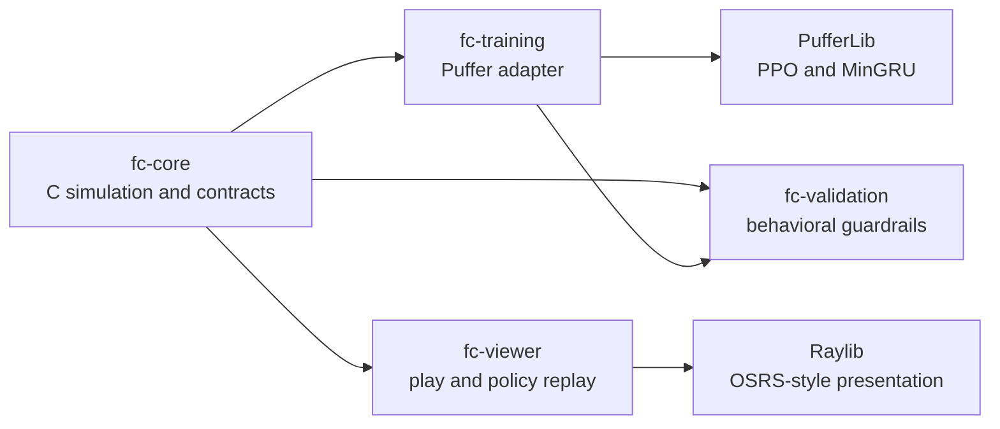

# Fight Caves RL

Fight Caves RL is a deterministic C simulation of Old School RuneScape's
63-wave Fight Caves, a PufferLib PPO training integration, and a Raylib viewer
for human play and checkpoint replay.

The project trains from scratch without demonstrations or a scripted policy.
The live task uses the SOTA Twisted bow/Masori loadout, no food, no Prayer
potions, and three policy action heads: movement, target selection, and Prayer.

## Current baseline

The promoted baseline is W&B run
[`txqsiahp`](https://wandb.ai/jbailey8531-oakton-college/fight+caves+rl/runs/txqsiahp).
It uses the current OSRS-parity backend and the exact trainer recipe selected by
sweep run `1nvvx5qu`, with both correct-Prayer reward weights set to zero.

| Property | Live value |
| --- | --- |
| Config | [`runescape-rl/config/fight_caves.ini`](runescape-rl/config/fight_caves.ini) |
| Training budget | 750 million agent steps |
| Policy | 3-layer MinGRU, 512 hidden units |
| Vectorization | 4,096 agents, 2 buffers, 16 threads |
| Policy input | 319 floats: 285 policy features plus 34 policy-visible legality bits |
| Policy actions | `[17, 9, 8]`: movement, attack target, Prayer |
| Final Jad kill rate | 92.74% |
| Final wave-63 reach rate | 94.12% |
| Final average damage taken | 978.0 |

The key recent comparisons are final post-training evaluations:

| Run | Role | Steps | Jad kill | Wave 63 | Damage taken |
| --- | --- | ---: | ---: | ---: | ---: |
| `1nvvx5qu` | selected Stage 2 sweep recipe | 750M | 94.79% | 95.94% | 877.7 |
| `8oivozuq` | exact standalone reproduction | 750M | 94.79% | 95.94% | 877.7 |
| `i215ulj4` | current parity backend, old Prayer reward | 750M | 88.02% | 89.91% | 973.5 |
| `txqsiahp` | current baseline, Prayer reward zero | 750M | 92.74% | 94.12% | 978.0 |

The exact 130-run sweep analysis is in
[`sweep_top8.md`](sweep_top8.md). Historical runs and configuration changes are
preserved in
[`run_history.md`](runescape-rl/docs/run_history.md); old labels such as
"current" describe their point in history, not the live repository.

## Architecture



- `fc-core` owns all authoritative gameplay: ticks, combat, Prayer, movement,
  pathfinding, collision, line of sight, NPC behavior, waves, observations,
  rewards, masks, and render events. It is deterministic and allocates no heap
  memory in the tick hot path.
- `fc-training` is a thin PufferLib adapter. It links the normal `fc_core`
  library and contains no renderer or Raylib dependency.
- `fc-viewer` uses the same core for human play and policy replay. Its actor,
  combat-presentation, animation, minimap, asset, UI, and debug modules own
  presentation only.
- `fc-validation` contains focused contract, parity, determinism, movement,
  combat, reward, replay, and integration guardrails.
- `tools/validation` owns run manifests, compiled-contract checks, checkpoint
  compatibility, and source-level configuration guardrails.

The simulator and viewer use only files in this repository at runtime. The
collision, movement, and line-of-sight maps are required and fail closed when
missing. Viewer models, animations, sprites, terrain, objects, projectiles, and
the minimap are cache-derived assets under `runescape-rl/fc-viewer/assets`.

## Requirements and setup

- Linux; the active development environment is Ubuntu 24.04.
- Python 3.12 or another version supported by the vendored PufferLib 4 tree.
- CMake 3.20+, GCC/G++, and a standard OpenGL/X11 development environment.
- An NVIDIA GPU and compatible CUDA/cuDNN/PyTorch stack for GPU training.
- Raylib 5.5 headers and static library, already vendored under
  `runescape-rl/fc-viewer/raylib`.

From the checkout root:

```bash
python3 -m venv runescape-rl/.venv
runescape-rl/.venv/bin/python -m pip install --upgrade pip
runescape-rl/.venv/bin/python -m pip install -e ./pufferlib_4
```

### Build and test

```bash
cmake -S runescape-rl -B runescape-rl/build -DCMAKE_BUILD_TYPE=Release
cmake --build runescape-rl/build -j
ctest --test-dir runescape-rl/build --output-on-failure
```

### Play

```bash
./runescape-rl/build/fc-viewer/fc_viewer
```

The console area contains NPC targeting, wave selection, TPS presets, debug,
and viewer-only god-mode controls. The friends tab contains the Player, Obs,
Mask, Reward, and Log diagnostics. Debug rendering can show collision, routes,
line of sight, attack range, occupied footprints, and Prayer-lock windows;
none of these overlays changes core gameplay.

Useful playable controls:

- Left click an arena tile or minimap location to route; click an NPC to attack.
- `1`, `2`, `3` toggle Protect from Melee, Missiles, or Magic.
- `X` toggles running; `Space` pauses; `Right Arrow` advances one tick.
- `R` resets; `F1` through `F8` spawn debug NPC types; `F9` toggles viewer god mode.
- `D` or `O` toggles diagnostics; `Shift+O` cycles overlay groups.
- `G` toggles the tile grid; `C` toggles collision.
- `4` and `5` select camera presets; `L` toggles camera follow.
- Right-drag orbits, the scroll wheel zooms, and `Q` or `Esc` quits.


### Train

W&B is enabled by default. From `runescape-rl`:

```bash
cd runescape-rl
./train.sh train \
  --config config/fight_caves.ini \
  --tag v4.5_current_baseline
```

`train.sh` selects Python, synchronizes the chosen INI into the sibling
PufferLib tree, rebuilds the backend when its source stamp changes, validates
the compiled policy contract, selects a contract-specific checkpoint
directory, writes a reproducibility manifest, and launches PufferLib.

Useful variants:

```bash
./train.sh train --config config/fight_caves.ini --no-wandb
LOAD_MODEL_PATH=/absolute/path/checkpoint.bin ./train.sh train --config config/fight_caves.ini --tag warm_start
./train.sh sweep --config config/experiments/example.ini --tag example --wandb-group example
```

### Replay a checkpoint

The evaluator validates the active config, compiled backend, checkpoint
sidecar, model dimensions, and parameter count before launching the viewer:

```bash
cd runescape-rl
python3 fc-viewer/eval_viewer.py --ckpt /absolute/path/checkpoint.bin
```

Use `--episodes 1` to exit after one episode and `--speed 1`, `2`, `4`, or `10`
to select the initial replay multiplier. Without `--episodes`, replay continues
across episodes until the window is closed.

## Live contracts and rewards

The authoritative observation, action, reward-feature, and mask dimensions are
in
[`fc_contracts.h`](runescape-rl/fc-core/include/fc_contracts.h). The Puffer
adapter writes 285 normalized policy features followed by the first 34 legality
bits into the model input and also supplies those same legality bits through
PufferLib's native mask channel. The model does not receive the 20 raw reward
features.

The live nonzero reward configuration is:

| Channel | Weight or schedule |
| --- | ---: |
| Net cave/wave progress | `0.001` |
| Damage taken | `-0.25` |
| Cave completion | `+1.0` |
| Player death | `-1.0` |
| Prayer points lost | `-0.02` |
| Invalid action | `-0.1` |
| Per-tick cost | `-0.0001` |
| NPC healing | `-0.005` |
| No progress after 800 / 1,600 / 2,400 ticks | `-0.001 / -0.005 / -0.02` |
| No attack after 50 ticks | base `-0.005`, wave scale `0.05` |

Damage dealt, NPC/wave/Jad kills, correct Prayer, unnecessary Prayer, Jad-only
healing, and the old wave-stall channels are zero. The scalar reward is clipped
to `[-1, 1]` by the trainer contract.

## Documentation

- [`TODO.md`](TODO.md) contains unfinished work only.
- [`docs/README.md`](runescape-rl/docs/README.md) identifies current sources of
  truth and historical records.
- [`run_history.md`](runescape-rl/docs/run_history.md) preserves training-run
  provenance.
- [`sweep_history.md`](runescape-rl/docs/sweep_history.md) and
  [`sweep_top8.md`](sweep_top8.md) preserve sweep evidence.
- [`baseline.md`](baseline.md) records the fixed 100M behavior-preservation
  series used during the refactor program.
- [`fc_cleanup_and_parity_history.md`](runescape-rl/docs/archive/fc_cleanup_and_parity_history.md)
  archives completed parity, refactor, dead-code, and documentation decisions.

## Remaining work

The current priorities are real run-energy mechanics, the remaining verified
encounter-parity differences, recurrent-state/evaluation hygiene, a
learning-rate schedule experiment, multi-seed confirmation, explicit trainer
reference tests, and clean-clone/PufferLib PR packaging. See
[`TODO.md`](TODO.md) for the authoritative list.

## License

MIT License.
